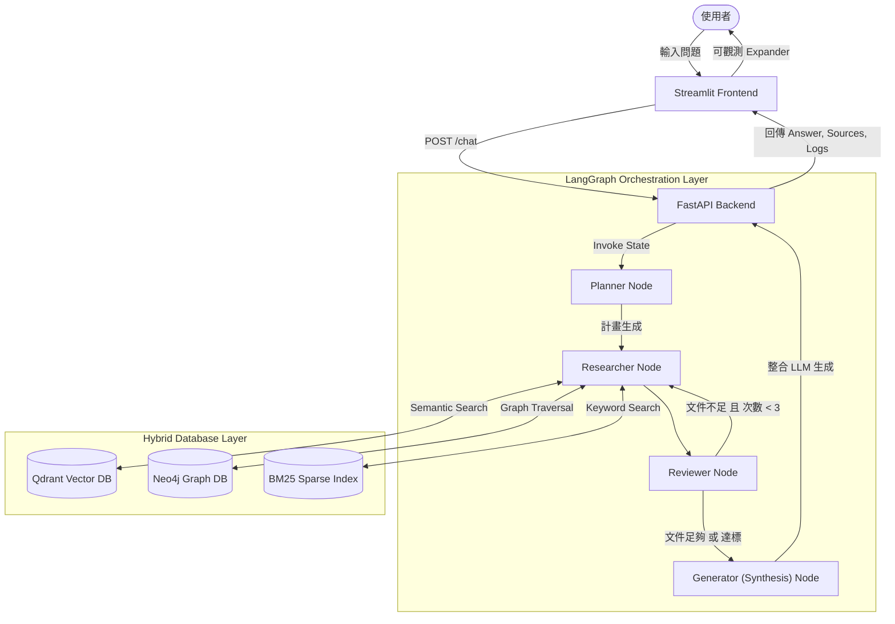

# 🧠 Domain-Specific Deep Research Agentic RAG


## 📌 專案標題與簡介

**Domain-Specific Deep Research Agentic RAG** 是一個專為特定領域打造的「深度研究代理式檢索增強生成系統」。

傳統的 RAG 往往面臨「Multi-hop Reasoning能力不足」、「單次檢索命中率低」以及「多輪對話上下文遺失」等挑戰。為解決這些痛點，本專案導入了 **Agentic Workflow** 架構，結合知識圖譜與向量檢索，使 AI Agent能夠像人類研究員一樣：主動拆解問題、擬定摘要計畫、進行跨資料庫的多輪檢索過濾，最終統整生成具有高度可信力且附帶引用的答案。

此專案設計符合生產環境標準，具備前後端分離、非同步處理與容器化部署。

---

## 🚀 核心技術亮點

### 1. 動態混合檢索 (Hybrid Retrieval)
捨棄單一的向量搜尋，實作了強大的多路召回（Multi-way Recall）機制：
- **Qdrant (Vector DB)**：透過 HuggingFace Embedding（如 BAAI/bge-base-zh-v1.5）進行深層語意檢索。
- **Neo4j (Graph DB)**：基於實體（Entity）與關聯（Relationship）進行精準的知識圖譜穿透。
- **BM25 (Sparse Retrieval)**：捕捉長尾與精確關鍵字的傳統稀疏檢索（Sparse Retrieval）。
配合末端的倒數排名融合（RRF）與去重邏輯，確保 LLM 獲得最高品質的 Context。

### 2. 代理協作與記憶 (Agentic Workflow & Memory)
基於 [LangGraph](https://python.langchain.com/docs/langgraph/) 實作分散式狀態機工作流：
- **Planner Node**：分析使用者意圖，產出檢索計畫。
- **Researcher Node**：攜帶計畫進入多資料庫深潛，最高支援 3 次 Multi-hop 遞迴檢索。
- **Reviewer Node**：查驗搜尋結果數量與品質，決定是否需要重啟（Route back）或中場結案。
- **Generator Node**：嚴格約束 Prompt 的 Synthesis Layer，確保 Zero-hallucination 並標註 Source。

### 3. LLMOps 整合
- 整合 **LangSmith** 追蹤 LangGraph 狀態軌跡，實現 Token 消耗與延遲監控。
- 支援 **Ragas / TruLens**（待解鎖），能夠對「Context Precision（檢索精準度）」與「Answer Relevance（回答相關性）」進行量化評估。

### 4. 生產級基礎設施
- **FastAPI Backend**：非同步、基於 Pydantic 強型別合約的 RESTful API，並完備 Error Handle 捕捉機制。
- **Streamlit Frontend**：具備 Expander 元件的聊天介面，完美將 Agent 的「思考鏈」與「檢索來源庫 (Sources)」白箱化可視化。
- **Docker 容器化**：透過 `docker-compose` 一鍵編排 API, UI, Qdrant 與 Neo4j 等微服務集群。
- **CI/CD**：完備的 `.github/workflows/ci.yml` 腳本確保 Code Quality 與 `pytest` 單元測試覆蓋。

---

## 💡 應用場景展示

本系統具備高度的領域適應性。為了面試展示與功能驗證，專案內建了**台灣《道路交通管理處罰條例》**的測試語料（位於 `data/raw/`，包含 TXT, CSV, JSON 格式）。

當您啟動服務後，可以直接輸入以下測試問題：
> 「請問沒戴安全帽要罰多少錢？」
> 「汽車駕駛人行駛道路時使用手機會有什麼處罰？」

RAG Agent 會自主拆解意圖，從法規中精準檢索條文，並匯整出附帶資料來源的專業解答，完美展示其在法務、合規查閱等垂直領域的應用潛力。您亦可隨時清空 `data/raw/` 替換為金融財報或醫療指引，系統即可無縫且快速轉換為該領域的專業助理。

---

## 🏗️ 系統架構圖 (System Architecture)



---

## 📂 目錄結構 (Structure)

```text
deep_research_rag/
├── data/
│   ├── raw/             
│   ├── processed/       # BM25 索引檔 (bm25_index.pkl)
│   └── qdrant_db/       # 本機向量資料庫
├── scripts/
│   ├── ingest_data.py   # ETL 資料匯入腳本 (文件解析、切塊、多重資料庫寫入)
│   └── ...
├── src/
│   ├── api/             
│   ├── db/              # Hybrid DB Layer 介面與實作 (base.py, qdrant_store.py, neo4j_store.py, bm25_store.py)
│   ├── orchestration/   # Agentic Workflow 工作流 (graph.py, state.py, nodes/*)
│   ├── synthesis/       # 生成層與提示詞管理 (generator.py)
│   └── ui/              
├── tests/               
├── .github/workflows/   
├── .env.example         
├── docker-compose.yml   
├── Dockerfile           
├── requirements.txt     
└── README.md            
```

---

## 🛠️ 快速啟動 (Getting Started)

### 1. 準備環境變數
請複製根目錄下的 `.env.example` 並更名為 `.env`，填入您的 OpenAI API 金鑰與資料庫配置：
```bash
cp .env.example .env
```
修改 `.env` 內容：
```env
OPENAI_API_KEY=sk-your-openai-api-key-here
QDRANT_URL=http://localhost:6333
NEO4J_URI=bolt://localhost:7687
```

### 2. 資料匯入 (Ingestion Pipeline)
將您的知識庫檔案（`.txt`, `.pdf`, `.csv`, `.json`）放入 `data/raw/` 目錄中，接著執行 ETL 腳本。腳本會自動切分（Chunking）並送入三套資料庫引擎建立索引：
```bash
python scripts/ingest_data.py
```

### 3. Docker
確保本機已安裝 [Docker](https://www.docker.com/) 與 Docker Compose，在專案根目錄執行：
```bash
docker-compose up --build -d
```
指令執行完畢後，即可訪問以下服務：
- **Agent Frontend (Streamlit)**: [http://localhost:8501](http://localhost:8501)
- **Backend API Docs (Swagger)**: [http://localhost:8000/docs](http://localhost:8000/docs)
- **Qdrant Dashboard**: [http://localhost:6333/dashboard](http://localhost:6333/dashboard)

### 4. 本地端開發 (Local Development)
如果您想在本地進行開發或除錯，請確保擁有 Python 3.9+ 環境：
```bash
# 1. 建立並啟動虛擬環境 (以 Conda 為例)
conda create -n ragenv python=3.9
conda activate ragenv

# 2. 安裝套件
pip install -r requirements.txt

# 3. 執行測試腳本
pytest tests/

# 4. 手動啟動服務
# 若在 Windows 環境下，可直接點擊專案下方的 `run.bat`
# 後端 API
uvicorn src.api.server:app --host 0.0.0.0 --port 8000 --reload
# 前端 UI
streamlit run src/ui/app.py
```
